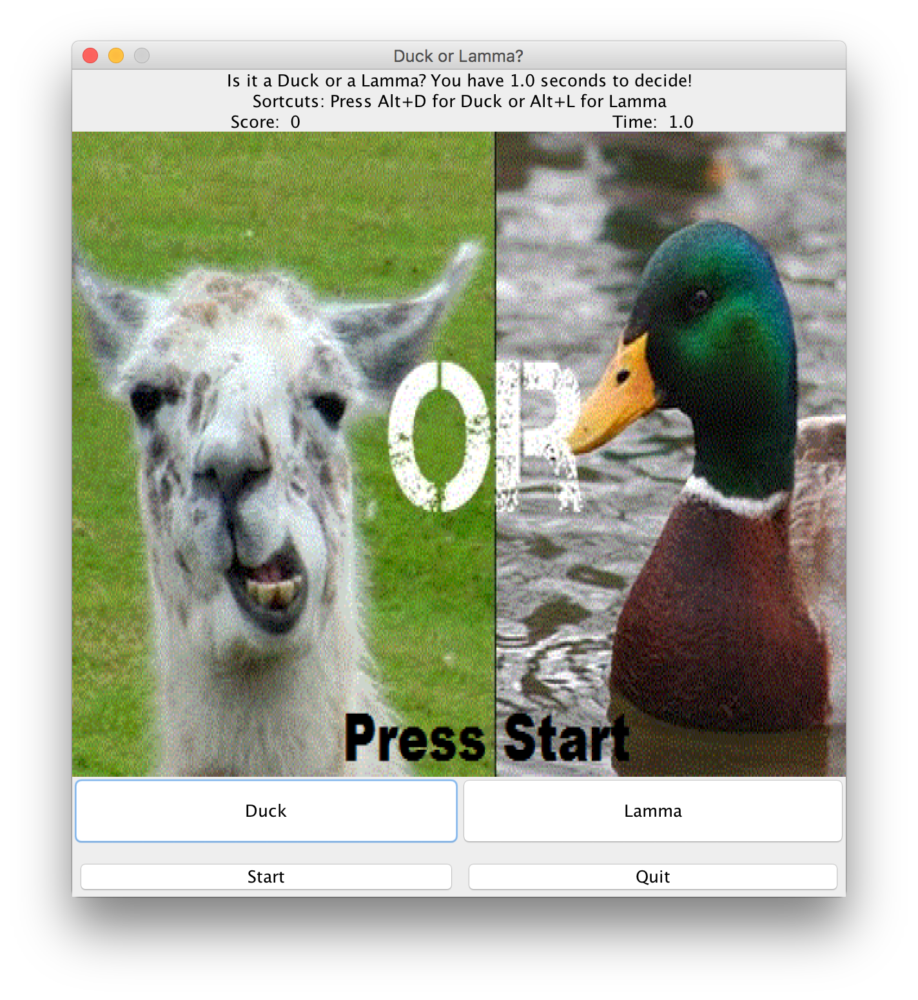
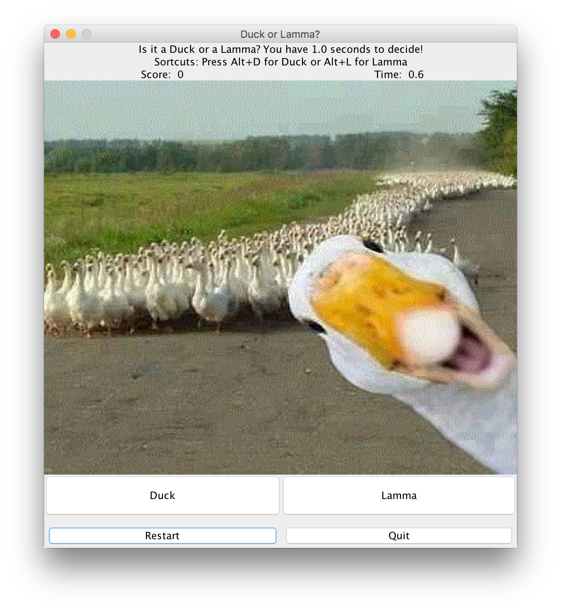
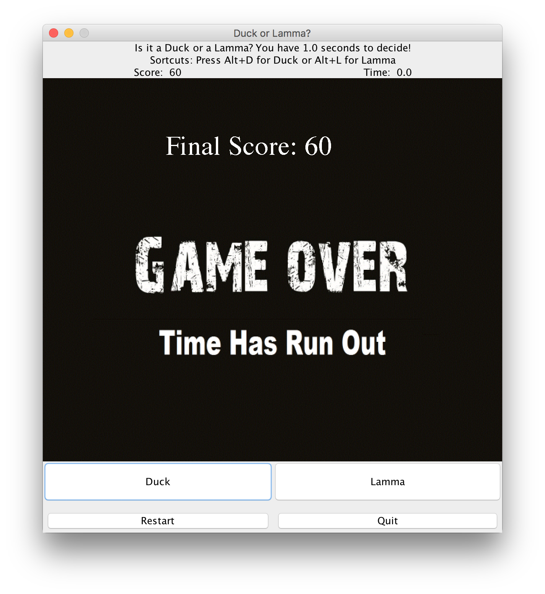

# DuckLamma
A simple game built in Java using Swing and awt

## Installation 
```
javac *.java
java DuckLammaApp
```

## Goal
You have 1 second to decide if the picture shows a Duck or a Lamma. Good luck!

## Controls
- Press the appropriate button (Duck or Lamma)
- Use the keyboard shortcuts (only working on Windows) to speed up your answers

## Screenshots



